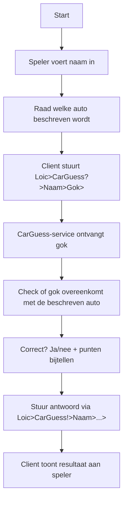
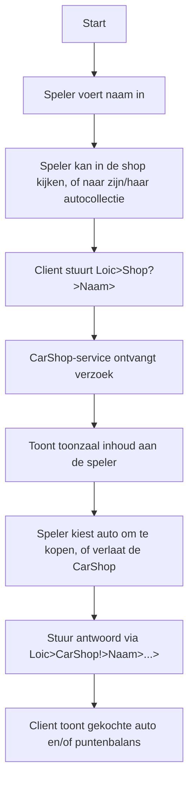
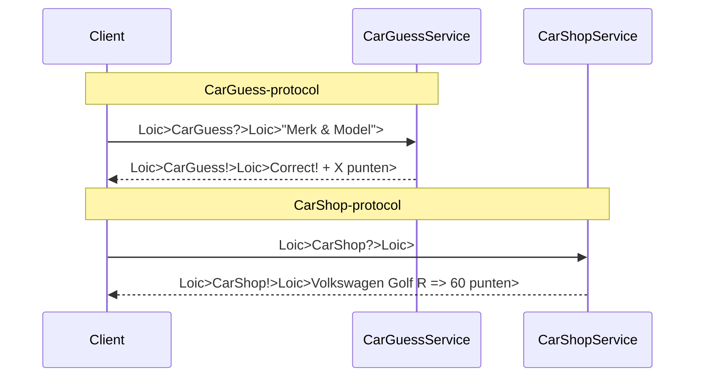

# CarGuess - Benternet Project

Welkom bij **CarGuess**! Dit project bevat een ZeroMQ-gebaseerde minigame, deze werkt op het Benternet-netwerk.

- **CarGuess** - Er worden 5 belangrijke details over een auto gegeven, de speler moet raden welke auto het is, merk en model. De details worden apart verstuurd, tussen elk mag de speler een keer raden of een raadpoging overslaan. Er komen dus 5 raad momenten, maar de speler mag er maar 3 van gebruiken.
Te sneller de speler raad en te specialer de auto, te meer de punten.

- **CarShop** - Met de vrijgespeelde punten kan de speler auto's kopen in de shop. De speler kan dan een link naar een mooie foto krijgen van de auto.

Beiden games delen dezelfde **spelersnaam** en **puntenbalans**, waardoor er één geïntegreerde spelervaring ontstaat.

## Overzicht

Spelers communiceren via ZeroMQ met de services die op het Benternet draaien. De speler:

1. Voert zijn naam in.
2. Stuurt een verzoek naar een van de services.
3. Krijgt een gepersonaliseerd antwoord terug met resultaat en puntenupdate.

Punten worden bijgehouden **per naam**, en bestaan alleen in het service-geheugen (uitbreidbaar met file parsing).

## CarGuess Flow



## CarShop Flow


## Gemeenschappelijk gebruik van naam & punten
Beide services houden per spelernaam de punten bij.
Dit betekent:
- Elke service onthoudt lokaal de puntenstand van spelers.
- Dezelfde naam = dezelfde speler (in beide spellen).
- Spelers kunnen dus punten winnen in CarGuess en gebruiken in CarShop.

## Communicatieschema


## Bestandsoverzicht
- carguess_service.cpp – C++ CarGuess-server
- carshop_service.cpp – C++ CarShop-server
- client.cpp – CLI-client voor CarGuess

## Uitvoeren
```bash
# CarGuess server starten
./carguess_service

# CarShop server starten
./carshop_service

# CarGuess client starten (C++)
./client
```

## Auteurs
Loic Schillings - Benternet project voor Network Programming